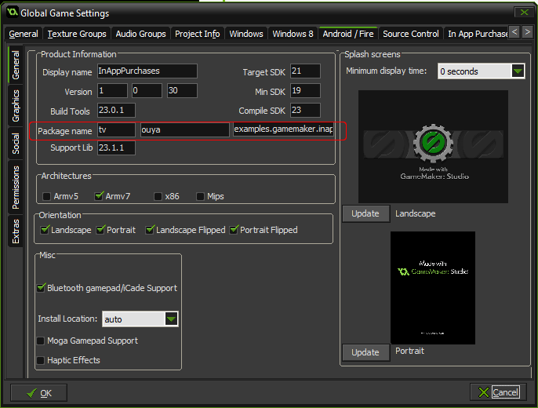
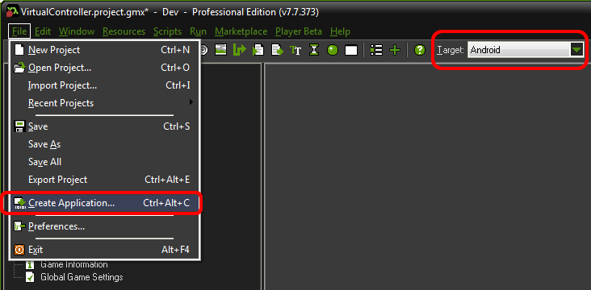
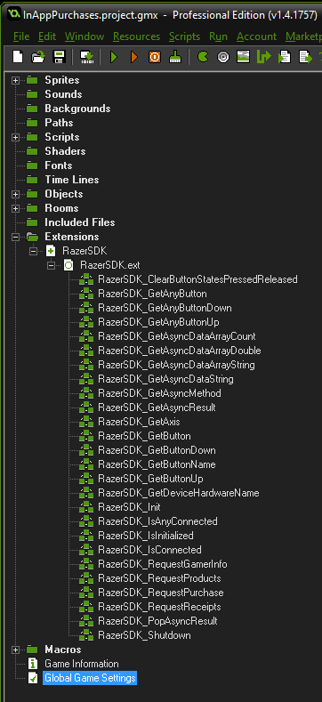
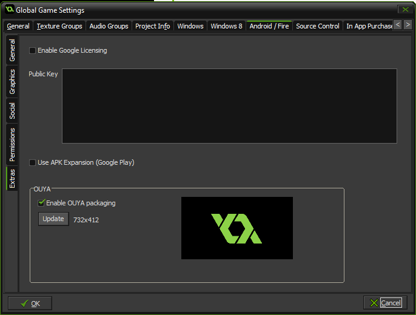
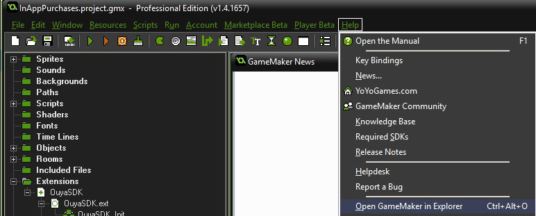
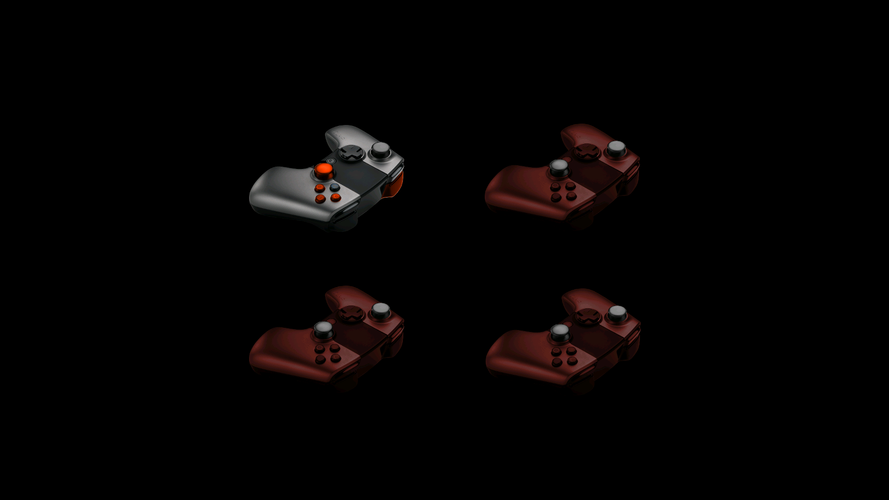
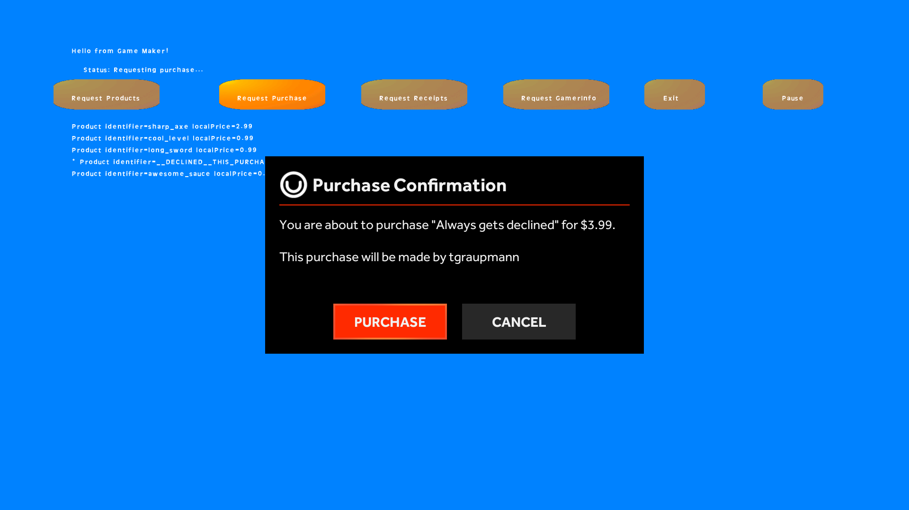

## Game Maker Engine

* The [RazerSDK](https://github.com/razerofficial/razer-sdk-docs) can be accessed via the `RazerSDK GameMaker Extension`.

### Downloads

[Example Source](https://github.com/ouya/ouya-sdk-examples/tree/master/GameMaker)

### Forums

[Forge TV on Razer Forums](https://insider.razerzone.com/index.php?forums/razer-forge-tv.126/)

[YoYo Games Forums](https://forum.yoyogames.com/index.php)

# Releases #

* [GameMaker-RazerSDK-Extension](https://github.com/razerofficial/game-maker-razer-sdk/releases) - Compatible with the new GMS Gradle build system plus enables `OUYA` Everywhere Input and In-App-Purchases in GameMaker Studio.

## Guide

* In your project's `Global Game Settings`, on the `Android` tab, in `General`, enter your `Package name` matching the [developer portal](http://devs.ouya.tv).



* Select the `Android` target and use the `File` menu and select the `Create Application` menu item to build and deploy to the connected `ADB` device.



## Resources

* Game Maker - http://yoyogames.com/gamemaker/download

* Game Maker Wiki - http://wiki.yoyogames.com/index.php

* Game Maker Studio Setup for Android - http://help.yoyogames.com/hc/en-us/articles/216753418-GameMaker-Studio-Global-Game-Settings-for-Android

* Create a [Native Extension](http://help.yoyogames.com/entries/30690273) For Android

## Video Tutorials

<b>GameMaker Studio Tutorials</b> - http://www.youtube.com/playlist?list=PLUYhFCYb2qeOBR9AVERSimlZEN-dXCoOW

## RazerSDK Extension

The `RazerSDK-GameMaker-Extension` is available in the [`releases section`](#user-content-releases).
GameMaker extension methods only use `String` and `double` for parameters and return types.

### Icons

* Be sure to prepare `default`, `store`, and `leanback` icons for your game. Check out the [content review guidelines](https://github.com/ouya/docs/blob/razer-sdk/content-review-guidelines.md#user-content-icons) for details.

#### Store Icon

* Edit the game icons in the `Global Game Settings`. In the `Project View`, `double-left-click` on `Global Game Settings`.



* On the settings `Android` tab, in the `Extras`, be sure to `Enable` the option for `Enable OUYA packaging` to be able to set the `store` icon in the `GUI`. And click `OK` to accept the changes.



#### Leanback Icon

* To enable the `leanback` icon, use the menu item `Help->Open GameMaker in Explorer` to manually edit the icon setting in the manifest.



* Navigate to the `GameMaker-Studio\Android\runner\AndroidManifest.xml` folder and open in a text editor. And the `android:logo="@drawable/banner"` to the application element and save the changes.

```
<application android:name="${YYAndroidPackageName}.RunnerApplication"
	android:label="@string/app_name"
	android:icon="@drawable/icon"
	android:logo="@drawable/banner">
```

Enable support for the `leanback` icon by setting the min platform to **API 19: Android 4.4 (KitKat)** and the target platform to **API 21: Android 5.0 (Lollipop)**.

```xml
    <uses-sdk
        android:minSdkVersion="19"
        android:targetSdkVersion="21" />
```

* Place the game `leanback` icon in the `extensions\OuyaSDK\AndroidSource\res\drawable\banner.png` project location. The folder will need to be created if it does not exist within the project. The `leanback` icon should be `320x180`.

### OUYA Everywhere

The `RazerSDK extension` uses `OUYA-Everywhere Input` which gets the input remapping for supported and future devices.

GameMaker automatically adds an extension entry in `AndroidManifest.xml` when the `RazerSDK` extension is added. Without the entry, the extension methods will not be invoked.

```xml
<manifest>
    <application>
        <!-- The number of GMS Android Extensions in use -->
        <meta-data android:name="YYNumExtensionClasses" android:value="1"/>
        
        <!-- Registers the GMS Extension so that the Android source events can be invoked -->
        <meta-data android:name="YYExtensionClass0" android:value="RazerSDK"/>
    </application>
</manifest>
```

### RazerSDK_IsInitialized

`RazerSDK_IsInitialized` returns true if the `RazerSDK` extension has been initialized.

### RazerSDK_GetAxis

Axis input can be obtained through `RazerSDK_GetAxis`. 

The `playerNumber` values "0", "1", "2", and "3" are expected for the first `String` parameter.

The `axis` values from below are expected for the second `String` parameter.

```
AXIS_LS_X = "0";
AXIS_LS_Y = "1";
AXIS_RS_X = "11";
AXIS_RS_Y = "14";
AXIS_L2 = "17";
AXIS_R2 = "18";
```

All the axis values for `Controller #1 (0)` can be obtained with the following code.

```
var lsX = RazerSDK_GetAxis("0", AXIS_LS_X);
var lsY = RazerSDK_GetAxis("0", AXIS_LS_Y);
var rsX = RazerSDK_GetAxis("0", AXIS_RS_X);
var rsY = RazerSDK_GetAxis("0", AXIS_RS_Y);
var l2 = RazerSDK_GetAxis("0", AXIS_L2);
var r2 = RazerSDK_GetAxis("0", AXIS_R2);
```

### RazeraSDK_GetButton

Button input can be obtained through `RazerSDK_GetButton`.

The `playerNumber` values "0", "1", "2", and "3" are expected for the first `String` parameter.

The `button` values from below are expected for the second `String` parameter.

```
BUTTON_O = "96";
BUTTON_U = "99";
BUTTON_Y = "100";
BUTTON_A = "97";
BUTTON_L1 = "102";
BUTTON_R1 = "103";
BUTTON_L3 = "106";
BUTTON_R3 = "107";
BUTTON_DPAD_UP = "19";
BUTTON_DPAD_DOWN = "20";
BUTTON_DPAD_RIGHT = "22";
BUTTON_DPAD_LEFT = "21";
BUTTON_MENU = "82";
```

All the button values for `Controller #1 (0)` can be obtained with the following code.

```
if (RazerSDK_GetButton("0", BUTTON_O)) {
}

if (RazerSDK_GetButton("0", BUTTON_U)) {
}

if (RazerSDK_GetButton("0", BUTTON_Y)) {
}

if (RazerSDK_GetButton("0", BUTTON_A)) {
}

if (RazerSDK_GetButton("0", BUTTON_L1)) {
}

if (RazerSDK_GetButton("0", BUTTON_R1)) {
}

if (RazerSDK_GetButton("0", BUTTON_L3)) {
}

if (RazerSDK_GetButton("0", BUTTON_R3)) {
}

if (RazerSDK_GetButton("0", BUTTON_DPAD_UP)) {
}

if (RazerSDK_GetButton("0", BUTTON_DPAD_DOWN)) {
}

if (RazerSDK_GetButton("0", BUTTON_DPAD_RIGHT)) {
}

if (RazerSDK_GetButton("0", BUTTON_DPAD_LEFT)) {
}
```

### RazerSDK_GetButtonDown and RazerSDK_GetButtonUp

Detecting the `Menu` button should use `RazerSDK_GetButtonDown` or `RazerSDK_GetButtonUp`.

```
if (RazerSDK_GetButtonDown("0", BUTTON_MENU)) {
}

if (RazerSDK_GetButtonUp("0", BUTTON_MENU)) {
}
```

The `playerNumber` values "0", "1", "2", and "3" are expected for the first `String` parameter.

The `button` values from above are expected for the second `String` parameter.

`RazerSDK_GetButtonDown` returns `true` when the button detected a `pressed` event.

`RazerSDK_GetButtonUp` returns `true` when the button detected a `released` event.

`RazerSDK_ClearButtonStatesPressedReleased` should be called at the end of the `Update` event each frame to clear the detected `pressed` and `released` states.

### RazerSDK_GetAnyButton

`RazerSDK_GetAnyButton` returns `true` if `any` controller is in the `pressed` state for the button `String` parameter.

```
if (RazerSDK_GetAnyButton(BUTTON_O)) {
}

if (RazerSDK_GetAnyButton(BUTTON_U)) {
}

if (RazerSDK_GetAnyButton(BUTTON_Y)) {
}

if (RazerSDK_GetAnyButton(BUTTON_A)) {
}

if (RazerSDK_GetAnyButton(BUTTON_L1)) {
}

if (RazerSDK_GetAnyButton(BUTTON_R1)) {
}

if (RazerSDK_GetAnyButton(BUTTON_L3)) {
}

if (RazerSDK_GetAnyButton(BUTTON_R3)) {
}

if (RazerSDK_GetAnyButton(BUTTON_DPAD_UP)) {
}

if (RazerSDK_GetAnyButton(BUTTON_DPAD_DOWN)) {
}

if (RazerSDK_GetAnyButton(BUTTON_DPAD_RIGHT)) {
}

if (RazerSDK_GetAnyButton(BUTTON_DPAD_LEFT)) {
}
```

### RazerSDK_GetAnyButtonDown

`RazerSDK_GetAnyButtonDown` returns `true` if `any` controller had a `pressed` state event in the last update frame for the button `String` parameter.

### RazerSDK_GetAnyButtonUp

`RazerSDK_GetAnyButtonUp` returns `true` if `any` controller had a `released` state event in the last update frame for the button `String` parameter.

### RazerSDK_IsConnected

`RazerSDK_IsConnected` returns `true` if the `playerNum` first `String` parameter is connected.

### RazerSDK_IsAnyConnected

`RazerSDK_IsAnyConnected` returns `true` if any controller is connected.

### Async calls

`RazerSDK_GetAsyncMethod` is used to get the async completion result from async methods called in the `RazerSDK extension`.
Async completion results sit on a stack and `RazerSDK_GetAsyncMethod` gets the method name from the current completed result.

```
asyncMethod = RazerSDK_GetAsyncMethod();
if (asyncMethod != undefined &&
    asyncMethod != "") {
    text_message = "Status: Method="+asyncMethod;
}
```

`RazerSDK_GetAsyncResult` will return a JSON `string` about the `method` and `data` corresponding to the async completion result.

```
asyncResult = RazerSDK_GetAsyncResult();
if (asyncResult != undefined &&
    asyncResult != "") {
    text_message = "Status: Method="+asyncMethod+" json="+asyncResult;
}
```

When all the details are extracted from the completion result, invoking `RazerSDK_PopAsyncResult` will move on to the next completion item.

```
RazerSDK_PopAsyncResult();
```

There are various helper methods for accessing the JSON data for the async completion result.
All async completion results have a `string` method and a `data` object. 

* `RazerSDK_GetAsyncMethod` - Returns the `string` name of the async completion method

* `RazerSDK_GetAsyncDataString` - Returns the `string` value for the completion data given the `string` field.

```
if (asyncMethod == "onFailureRequestPurchase") {
    var errorMessage = RazerSDK_GetAsyncDataString("errorMessage");            
}
```

* `RazerSDK_GetAsyncDataArrayCount` - Returns the `double` count of items in the `data` structure

```
if (asyncMethod == "onSuccessRequestReceipts") {
    var count = RazerSDK_GetAsyncDataArrayCount();
    text_message = "Status: RequestReceipts count="+string(count);
}
```

* `RazerSDK_GetAsyncDataArrayString` - Returns the `string` value of the given `field` for a given array `index` from the `data` structure

```
for (var index = 0; index < count; ++index)
{
    var identifier = RazerSDK_GetAsyncDataArrayString(string(index), "identifier");
}
```

* `RazerSDK_GetAsyncDataArrayDouble` - Returns the `double` value of the given `field` for a given array `index` from the `data` structure

```
for (var index = 0; index < count; ++index)
{
	var localPrice = RazerSDK_GetAsyncDataArrayDouble(string(index), "localPrice");
}
```

### RazerSDK_RequestLogin

`RazerSDK_RequestLogin` is an async call that opens the login dialog to sign in the user.

`RazerSDK_GetAsyncMethod` will return `onSuccessRequestLogin` or `onFailureRequestLogin` when the request has completed.

The success event indicates the user has successfully signed in or the user was already signed in. The failure event indicates there was a problem signing in. The cancel event indicates the user canceled signing in.

### RazerSDK_RequestGamerInfo

`RazerSDK_RequestGamerInfo` is an async call that provides access to the `GamerInfo` which has the gamer's `uuid` and `username`.

`RazerSDK_GetAsyncMethod` will return `onSuccessRequestGamerInfo` or `onFailureRequestGamerInfo` when the request has completed.

The failure event will be invoked if the user is not signed in.

### RazerSDK_RequestProducts

`RazerSDK_RequestProducts` is an async call that provides access to the `Product` details.
The first parameter is a `string` comma separated list of identifiers.

`RazerSDK_GetAsyncMethod` will return `onSuccessRequestProducts` or `onFailureRequestProducts` when the request has completed.

### RazerSDK_RequestPurchase

`RazerSDK_RequestPurchase` is an async call that requests purchase of a `Product`.
The first parameter is a `string` which is a `Product` identifier.
The second parameter is a `string` which is the `Product Type` ("ENTITLEMENT" or "CONSUMABLE").

`RazerSDK_GetAsyncMethod` will return `onSuccessRequestPurchase`, `onFailureRequestPurchase` or `onCancelRequestPurchase` when the request has completed.

The failure event will be invoked if the user is not signed in.

```
identifier = "YOUR_PRODUCT_ID";

// Purchase Entitlement
RazerSDK_RequestPurchase(identifier, "ENTITLEMENT");

// Purchase Consumable
RazerSDK_RequestPurchase(identifier, "CONSUMABLE");
```

### RazerSDK_RequestReceipts

`RazerSDK_RequestReceipts` is an async call that requests all the `entitlement` purchases on the server.

`RazerSDK_GetAsyncMethod` will return `onSuccessRequestReceipts`, `onFailureRequestReceipts` or `onCancelRequestReceipts` when the request has completed.

The failure event will be invoked if the user is not signed in.

### RazerSDK_Shutdown

`RazerSDK_Shutdown` is an async call that shuts down the `RazerSDK` so the game can exit cleanly.

`RazerSDK_GetAsyncMethod` will return `onSuccessShutdown` or `onFailureShutdown` when the request has completed.

```
asyncResult = RazerSDK_GetAsyncResult();
if (asyncResult != undefined &&
    asyncResult != "") {
    asyncMethod = RazerSDK_GetAsyncMethod();
	if (asyncMethod == "onSuccessShutdown") {
		text_message = "Status: Shutdown success!";
		game_end();
	}
	else if (asyncMethod == "onFailureShutdown") {
		text_message = "Status: Shutdown failure!";
	}
}
```

## Examples

### Virtual Controller

The [Virtual Controller](https://github.com/razerofficial/game-maker-razer-sdk/tree/master/VirtualController.gmx) example shows 4 images of the controller which moves axises and highlights buttons when the physical controller is manipulated.



### In-App-Purchases

The [In-App-Purchase](https://github.com/razerofficial/game-maker-razer-sdk/tree/master/InAppPurchases.gmx) example uses the ODK to access gamer info, purchasing, and receipts.


